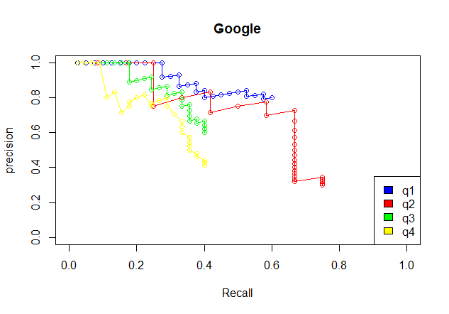
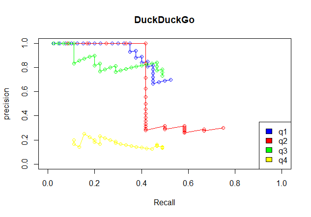
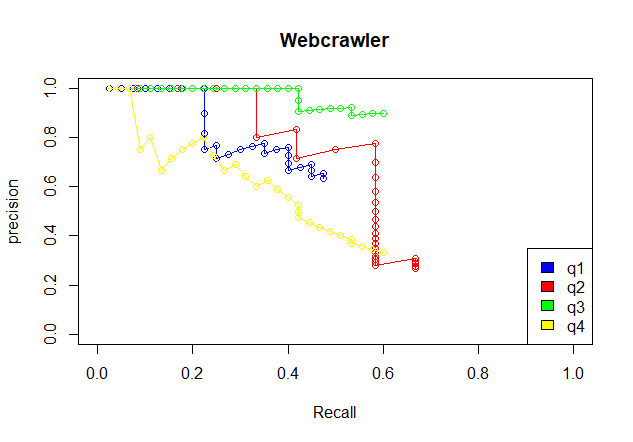
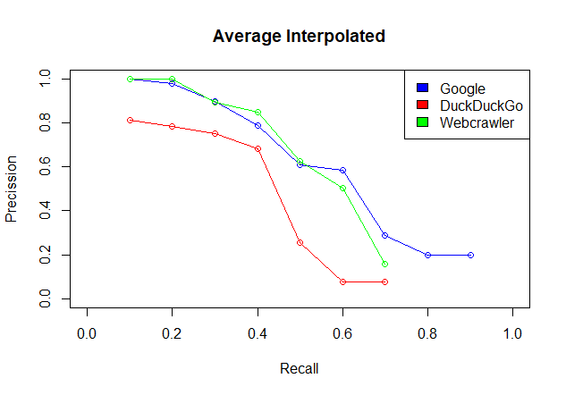

# First Assignment in course Internet Search Techniques and Business Intelligence (2019-2020) 
__Group Members:__ 
  * Ignatius Patrick
  * Dare Gbenga Christopher Akinboyewa
  * [Sitt Min Oo](https://github.com/Kortika)
  * [Vasileios Mormoris](https://github.com/VMormoris)

We look 4 queries in 3 different search engines. For each search engine we check for the top 30 suggestions that each made the relevance to the respective query. After that we calculated the precision and recall and the Average interpolated.

## Queries

  * __q1:__ _Fall of the Soviet Union_
  * __q2:__ _What is the tinder algorithm?_
  * __q3:__ _What is the population of Sierra Leone?_
  * __q4:__ _How banks transfer money?_

## Search Engines

  * [Google](https://www.google.com)
  * [DuckDuckGo](https://www.duckduckgo.com)
  * [Webcrawler](https://www.webcrawler.com)

## Results(Graphs)

  

  

  

## Notes about the source code
__Currently working directory in R is not the same with the directory that the file is located.__
_Change dirpath value on graphloting.R in order for the R script to work properly._
